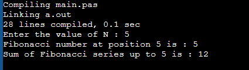

# Числа Фибоначчи

### Код

```pascal

program FibonacciNumber;

function fibonacci(n: Integer): Integer;
begin
    if (n = 0) or (n = 1) then
        fibonacci := n
    else
        fibonacci := fibonacci(n - 1) + fibonacci(n - 2);
end;

function fibonacci_sum(n: Integer): Integer;
begin
    if n <= 0 then
        fibonacci_sum := 0
    else if n = 1 then
        fibonacci_sum := 1
    else
        fibonacci_sum := fibonacci(n) + fibonacci_sum(n - 1);
end;

var
    n: Integer;

begin
    write('Enter the value of N : ');
    readln(n);
    writeln('Fibonacci number at position ', n, ' is : ', fibonacci(n));
    writeln('Sum of Fibonacci series up to ', n, ' is : ', fibonacci_sum(n));
end.

```

### Результат



# II.3. ПЕРЕВОД ЧИСЕЛ ИЗ ОДНОЙ СИСТЕМЫ СЧИСЛЕНИЯ В ДРУГУЮ

### Код

```pascal

program NumberSystem;

function convert_to_decimal(base: integer; digits: array of integer; n: integer; index: integer; current: integer): integer;
begin
  if index = n + 1 then
    convert_to_decimal := current
  else
    convert_to_decimal := convert_to_decimal(base, digits, n, index + 1, current * base + digits[index]);
end;

function convert_from_decimal(new_base: integer; num: integer; var result: array of integer; index: integer): integer;
begin
  if num = 0 then
    convert_from_decimal := index
  else
  begin
    result[index] := num mod new_base;
    convert_from_decimal := convert_from_decimal(new_base, num div new_base, result, index + 1);
  end;
end;

var
  p, n, q, i, digit, number, new_number : integer;
  sequence, new_sequence : array of integer;

begin
  write('Enter the base of the number system (p) : ');
  readln(p);
  
  write('Enter the number of digits in the number (n) : ');
  readln(n);
  SetLength(sequence, n+1);
  SetLength(new_sequence, n+1);
  
  writeln('## Enter the sequence of digits of the number ##');
  for i := 1 to n do
  begin
    write('Enter ', i, 'th : ');
    read(digit);
    sequence[i] := digit;
  end;
  
  write('Enter the new base of the number system (q) : ');
  readln(q);

  number := convert_to_decimal(p, sequence, n, 1, 0);
  
  new_number := convert_from_decimal(q, number, new_sequence, 1);
  
  write('The number in base ', q, ' is : ');
  for i := new_number - 1 downto 1 do
    write(new_sequence[i], ' ');

end.

```

### Результат


# II.2. ИТЕРАТИВНОЕ ВЫЧИСЛЕНИЕ БЕСКОНЕЧНЫХ СУММ

### Код

```pascal

```

### Результат
